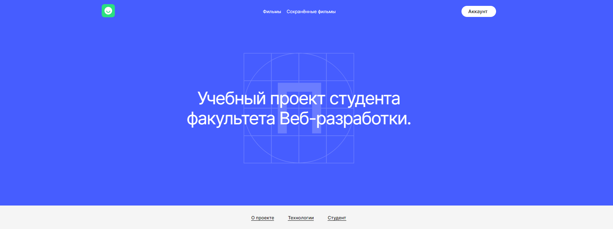

<h1>BeatFilm</h1>
<a src="https://movie.diplom.nomoredomainsmonster.ru/">Ссылка на проект</a> 
<a src='https://www.figma.com/file/6FMWkB94wE7KTkcCgUXtnC/Дипломный-проект?node-id=1%3A1200&mode=dev'>Макет - light-2</a> 
<a src="https://github.com/opigon1/movies-explorer-frontend-/pull/2">Ссылка на pull request</a> 
<h2>Технологии<h2>
<ol>
<li>React</li>
<li>React Router</li>
<li>Хуки (useState, useEffect, useContext)</li>
<li>работа с API</li>
<ol>

...
